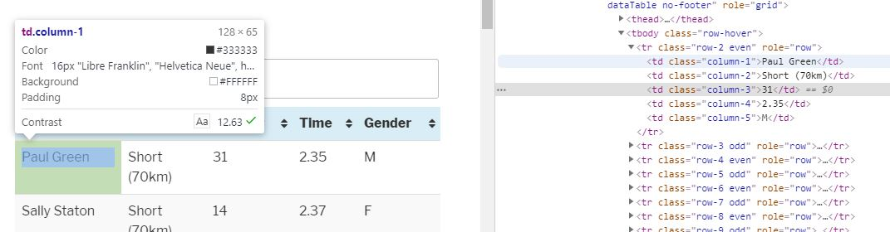

# Exploring the UK's Most Scenic Sportive

## Introduction

It is a very poorly kept secret that most of the time spent on a data science project isn’t actually spent doing data science – i.e. exploring your data set, selecting which algorithm to use, and training and testing models.
Oh no. Most likely you will spend most of your time trying to collect data, then trying to get it into a format that you can actually work with.  Unless you are lucky to work with a production system in which you can ask your friendly engineering team to record data in the form you’d like and pipeline it straight to you, you are going to have to do a lot of the legwork yourself. More often than not you will have to collect disparate data in different formats from multiple sources.

I never intended to write a post that illustrated this point, however a recent hobby project I worked on served to do just that.
Not wanting to look at one of the many well-known example data sets that are out there (because who really needs another [iris](https://en.wikipedia.org/wiki/Iris_flower_data_set) tutorial?)
I tried to think of a study that involved one of my favourite hobbies: cycling.  Like many other sports cycling (professional and amateur alike) is in equal parts buoyed and smothered by the wealth of data that its participants produce.  Personally I don’t use Strava, but I count plenty of my friends among those who agonise whenever they lose a K/QOM segment to someone on the morning commute.  Indeed, many who cycle use their own data as a personal trainer, encouraging them to go faster and further.  Personally, I prefer to enjoy the view... a fact my lacklustre finishing times will attest to!
I was therefore very lucky to participate in the Mull Sportive, spending one dreich weekend on the beautiful isle of Mull off the west coast of Scotland.
The Mull sportive is self-styled as "[The UK's Most Scenic Sportive](http://www.mullsportive.co.uk)", and you’d be hard pressed to disagree – the route winds alongside the brightly coloured houses of Tobemory in the North before sending you through the wildness surronding Ben More in the south.

The race comes in two flavours: the [shorter course](https://www.plotaroute.com/route/335477) is just shy of 43 miles with 3,914 ft of ascent, and the longer nearly [doubles the pain:](https://www.plotaroute.com/route/335470) 87 miles and a respectable 6,699 ft of ascent.  (If these numbers are impressive to you – consider that the longest day of the 2019 Tour de France was 143 miles.  That is why the pros have ridiculous thighs).

## Part 1 - Planning the project and getting the data

Like most organised sportives Mull now uses electronic chips for timing, with the data available post-race (along with age, course length and gender stats when provided). The data for the years 2011–2019 are available on the official website.  Unfortunately for me not all of the years provide a link to download the data, and the years that do can only supply a pdf.  To make matters worse, the fields and formats in the results data vary year by year, meaning we’ll have to write custom methods for each year to get what we need.

With this in mind, I think it best that we approach each year in turn with its own script, with a view to creating a pandas dataframe for each year. We can wrap each script in a ```get_data()``` method and then aggregate these into a master data frame via a central runner file in order to do our analysis.

### 2011

Right, enough waffle.  Let’s start at the beginning, in the year [2011](http://www.mullsportive.co.uk/results-2011/).  The results are all contained in a single html table so we can use the excellent [Beautiful Soup](https://www.crummy.com/software/BeautifulSoup/bs4/) package to parse the data and collect the contents of the ```<td>``` tags.  Opening the browser's inspect mode will allow me to determine the elements I need:





Now we can see that the data is stored in a parent table, in 5 columns and numerous rows.  We don’t need the 'Number' column (‘column-3’), so to get the data we can loop through each row and associate the value (in the <td> tag) with the column it is contained in.  Our code then becomes:

```python
import requests
from bs4 import BeautifulSoup
import pandas as pd
import numpy as np

base_url = 'http://www.mullsportive.co.uk/results-'
cols_2011 = ['name','course', 'time', 'gender']
df_2011 = pd.DataFrame(columns=cols_2011)
        
page = requests.get(base_url+'2011')
soup = BeautifulSoup(page.content, 'html.parser')
        
rows = soup.select("table[id=tablepress-10] > tbody > tr")
tds = [row.findAll('td', class_=['column-1','column-2', 'column-4','column-5' ]) for row in rows]
my_dict = [{cols_2011[i]: td[i].string for i in range(len(cols_2011))} for td in tds]
df_2011 = df_2011.append(my_dict)
```

Now from our initial survey of the other years, we know that other years have recorded the entrants ages too.  Unfortunately this is a recent trend, and apparently rider age was of no import to the good people at the Mull sportive back in the early days.  Nonetheless we have to handle missing values (including those for people who ran out of puff before the finishing line and didn't finish).  We'll also add and fill a 'year' column so we know these entries are from 2011. 

```python
df_2011['age'] = np.nan
df_2011.loc[df_2011['time'] == 'DNF', 'time'] = 0.00
df_2011['year'] = '2011'
```

And we’re nearly done, just the finishing times and the course variant to deal with - we'll store the times in a datetime format for easier manipulation later:

```python
df_2011['time'] = pd.to_datetime(df_2011['time'], format='%H.%M').dt.time
df_2011['course'] = df_2011['course'].str.split(n=1).str[0].str.lower() 
```
And that should be us.  We can examine the first few rows of the df_2011 object to see if what we have makes sense.

```python
In [1]: df_2011.head() 
Out[1]
               name course      time gender  age  year
0        Paul Green  short  02:35:00      M  NaN  2011
1      Sally Staton  short  02:37:00      F  NaN  2011
2      Mark Charles  short  02:37:00      M  NaN  2011
3  Billy Mackintosh  short  02:47:00      M  NaN  2011
4     Helen MacLeod  short  02:51:00      F  NaN  2011
```
Looks good to me!  Let's hope that 2012--2019 are as straightforward. 

### 2012

Looking at 2012  we can see that the data is once again contained in a HTML table, meaning that we can use Beautiful Soup to get what we need.   The rider 'Number' column we saw in 2011 has been dropped this time round, meaning we are now interested in the table headers with the classes: ``` 'column-1','column-2', 'column-3','column-4' ```. The format has changed slightly as the new ‘Class’ column contains the rider gender and age in a standard format, so after parsing the table using Beautiful Soup we can extract the gender from the first character of the string, with the age being the remaining characters:

```python
df_2012['age'] = df_2012["gender"].str[1:]
df_2012['gender'] = df_2012["gender"].str[:1]
```
The rest of the columns require similar treatment as 2011 so I won't post the code here.  Let's have a quick look to confirm that the 2012 dataframe looks as we'd expect:

```python
In [2]: df_2012.head()
Out[2]:
              name course gender      time age  year
0  Steven MacInnes   long      M  04:19:00  39  2012
1        Alan Dean   long      M  04:30:15  28  2012
2    David Stephen   long      M  04:32:30  48  2012
3    Mark Johnston   long      M  04:49:02  45  2012
4    Mike McKenzie   long      M  04:54:31  53  2012
```

I'm happy with that.  2013--16 follow similar patterns so I’ll gloss over them here. 

### 2017

For [2017--2019](http://www.mullsportive.co.uk/results-2017) a  fancy new format was used.  Results are now provided by ‘Race Result’, a 3rd party who provide timing solutions for event organisers.  The results page is now powered by two fancy widgets, one for each course.  Initially we are presented with shortened versions of the results, with the option to ‘show more’ or ‘show all’.  Of course, we have the option to download the lot as a pdf – which we could easily scrape with Beautiful Soup again – but where’s the fun in that? (Edit: scraping a pdf would have been a lot quicker, but I would've learned less.  I stand by my decision :D ). We’re going to need a way to interact the page to enact the ‘show all’ buttons for each table, wait for the data to load, and then scrape the results.  Thankfully, we can use the excellent [Selenium library](https://selenium-python.readthedocs.io/) to load an instance of a browser and tell it programatically which buttons to press.  In order to do this we have to tell Selenium where the element is, and thankfully we can pass in the ‘xpath’ path as generated via the inspector in chrome which makes our life easier.

So we can tell python to get the 'show all' button element for the top and bottom tables, press them then wait to display the full data and then use beautiful soup as before to generate our dataframes:

```python
from selenium import webdriver
from selenium.webdriver.common.by import By
from selenium.webdriver.support.ui import WebDriverWait
from selenium.webdriver.support import expected_conditions as EC

driver = webdriver.Chrome(executable_path=r'C:\Users\WhereverYourInstallationLives\Python\Chromium\chromedriver.exe')
base_url = 'http://www.mullsportive.co.uk/results-' 
driver.get(base_url + '2017')
               
#click the bottom link first, so that it doesn't affect position of top link
short_load = WebDriverWait(driver, 10).until(EC.visibility_of_element_located((By.XPATH, '//*[@id="divRRPublish"]/div[4]/table/tbody[7]/tr/td/a[2]')));
short_load.click()
time.sleep(2.5)  #wait for data to load
        
long_load = WebDriverWait(driver, 10).until(EC.visibility_of_element_located((By.XPATH, '//*[@id="divRRPublish"]/div[4]/table/tbody[3]/tr/td/a[2]')));
long_load.click()
time.sleep(2.5) #wait for data to load

#Parse with Beautiful Soup as before...
```
This is oddly satisfying to watch, as you can follow Selenium's interactions with the page in real time as it works its way through your script.

As the 2017,18 & 19 results pages all follow the same general layout we can copy the method for 2017 and apply to 2018--19. There are some slight variations in the column orders but nothing we can’t easily fix on inspection.  In an ideal world all the columns would be identical for each of the three years and we could write a generic method that takes in the year as an argument and does all the work for us!

Now, as I mentioned at the start I decided to arrange the project into a separate script for each year, with a runner file coordinating the scraping of each year.  The final part of the data collection phase involves a slight refactoring of each script to wrap them up in a  ```get_data()``` method which returns a data frame, which will be append to a master data frame before being written to a csv.  My file structure then becomes:
```
mull_cycle_project
|	|--1_getting_data
|		|--scripts
|	  		--mull_2011.py
|		    --mull_2012.py
|		 	     ...
|		    --mull_2019.py
|	  	    --__init__.py
|	--runner.py
|	--__init__.py
|	--df_master.csv	#created when runner is ...ran
```

 The runner file is fairly simple:

```python
import pandas as pd
from selenium import webdriver
import timeit

from scripts import mull_2011 #as per file diagram above
from scripts import mull_2012
# and so on...
from scripts import mull_2019

start_time = timeit.default_timer()
driver = webdiver.Chrome(executable_path=r'C:\Users\WhereverYourInstallationLives\Python\Chromium\chromedriver.exe')

df_master = pd.DataFrame()

df_master = df_master.append(mull_2011.get_data(), ignore_index=True)
df_master = df_master.append(mull_2012.get_data(), ignore_index=True)
#and so on...
#note we pass the web driver in as an argument for 2017-2019
df_master = df_master.append(mull_2017.get_data(driver), ignore_index=True)
#and so on...

driver.close()
   
df_master.to_csv('C:\\Users\\MyOutputLocation\\df_master.csv', encoding='utf-8')   

print ('runner.py completed in %f seconds' %  (timeit.default_timer() - start_time))
```

And when I run this we get:

```python
Getting 2011 data...
Getting 2011 data... OK
Getting 2012 data...
Getting 2012 data... OK
...
Getting 2018 data...
Getting 2018 data... OK
Getting 2019 data...
Getting 2019 data... OK
runner.py completed in 48.014508 seconds
```

Which is pleasing to see! Performance wise it is OK, considering this includes starting chrome and running the webdriver, as well as 5 seconds sleep time for each of 2017,18,19.  It is a one-time run script so it is not performance critical.  I'd only be updating it once a year when the new results come out.

If performance was an issue there are a number of things we could do to speed up this script.  We could look at running each ```get_data()``` function asynchronously (i.e run them in parallel on individual threads rather than in series) and we could be smarter about the 2.5s waiting after we use the webdriver to click the ‘show all' results buttons, but in the interests of keeping this series (relatively) brief I will leave things as they are just now.

To make sure everything has worked, let’s have a quick preview of our master dataframe:

```python
In [4]:df_master.tail()  #tail for a change, make sure latest data is there
Out[4]: 
     age course gender             name      time  year
1784  33  short      F      Amanda Reid  05:34:59  2019
1785  55  short      M     Ross Findlay  08:30:19  2019
1786  51  short      M    William Smith  00:00:00  2019
1787  49  short      M  Colin Tevendale  00:00:00  2019
1788  45  short      M      Ross Mickel  00:00:00  2019

In [5]:df_master.count()
Out[5]: 
age       1134
course    1789
gender    1782
name      1789
time      1789
year      1789
dtype: int64
```

It looks like everything has gone to plan, we have a populated dataframe with 1789 rows, with some entries marked by age and gender.  We can see from the .count() statistics that we have entries with missing values (there are only 1,134 rows with an age value, for example). 
However, as Part 1 of this post was concerned with getting the data only, this is a good point to take a break before Part 2 – Wrangling and exploring our dataset.