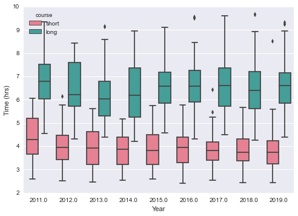
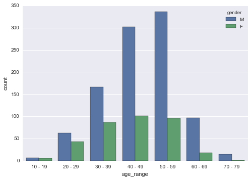
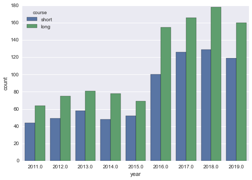
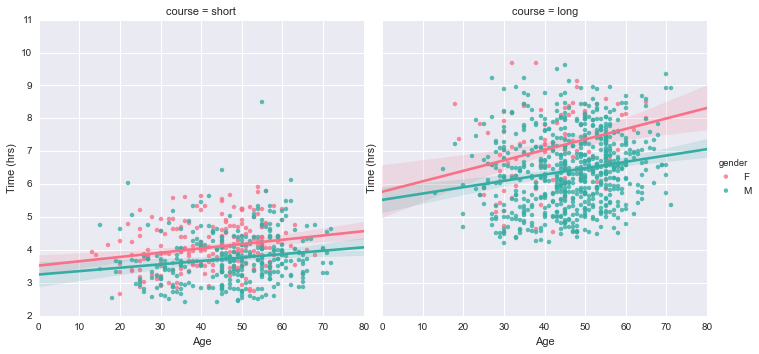
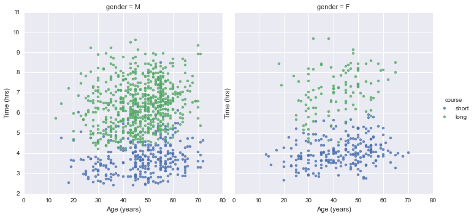

## Part 2 - Exploring and Visualising the Data

(Note: the accompanying code and data for this series can be found on my personal [Github page](https://github.com/fddata/MullCycle){:target="_blank"}.)

As we saw in the [previous section](), sometimes just getting our data in a usable form can sometimes take a little bit of work.  But we have now scraped the Mull Sportive website and written the data to a csv for some local analysis.

I'll write the workup script in different file and folder in order to keep concerns separate.  

The first thing we should concern ourselves with is how many null data points we have, as these should be excluded from any subsequent analysis.
Luckily for us the only thing that can be considered null in our dataset are the riders who did not finish, and in the previous section we gave them a time of 0.  These riders can be easily counted and discarded with the following: 
```python
dnf_count =  len(df.query('time == 0').index)
print( 'dnf_count: %s' % dnf_count)
#returns dnf_count: 38

#remove dnfs from the df
df = df.query('time != 0')
```
So we say goodbye to the 38 riders who fell by the wayside (hopefully not literally). 

There is another category of rider who also have what can be considered partial data - those riders for whom we have no age data.
Granted, we can still use their finish times and course information to do some basic analysis but ideally we want to leverage as much as we can with the information we have.  Of our remaining data points, how many have no age information?
```python
unknown_age_count =  sum(pd.isnull(df['age']))
print( 'unknown_age_count is: %s' % unknown_age_count)
#unknown_age_count is: 640
```

640 rows of our represents a significant portion of our dataset  so it'd be a shame to discard them.
I know that many people get addicted to cycling and try to beat their times for a particular course so chances are there are some 'repeat customers' for the Mull cycle.  Would it therefore be possible to see if there is anyone who has ran the race more than once and who has at least one entry with a known  age?  We can therefore potentially use the age data we know and extrapolate it to fill the data that we don't.  


```python
#who has run the race more than once? we are assumes nobody shares a name.
multi = df.groupby('name').filter(lambda x: len(x) > 1 ).sort('name')

#we only want where people have at least one NaN and at least one non-nan number

#let's write a helper function for the filtering.  .isnull returns the nan, count returns non-nulls
def get_multiples(df):
    return ((df['age'].isnull().sum() > 0 ) & (df['age'].count() > 0 ))

multi = multi.groupby('name').filter(lambda x: get_multiples(x)).sort(['name', 'age'])
```
The dataframe 'multi' now contains riders who are candidates for age extrapolation - that is those who have at least one unknown age and at least one known age.  My age extrapolation approach assumes that riders' names are unique and that the given ages are accurate.  

In order to perform the age extrapolation, we'll need to write a couple of helper functions to first get the riders age at a known year, and then year to calculate the riders age at for any given year.  I'll call these ```get_age()``` and ```fill_blanks()``` respectively.  

  ```python  
def get_age(x, known_age, known_year):
    return known_age - (known_year - x)    

def fill_blanks(df):
    known_year =  df.at[df.first_valid_index(), 'year']
    known_age = df.at[df.first_valid_index(), 'age']    
    unknown_rows = df.loc[df['age'].isnull()]
    unknown_rows.loc[:,['age']] = unknown_rows['year'].apply(lambda x : get_age(x, known_age, known_year))
    df.update(unknown_rows)
    return df

#apply to our dataframe of eligible riders
multi_filled = multi.groupby('name').apply(lambda x: fill_blanks(x))

#update our original dataframe
df_mf = df.copy()
df_mf.update(multi_filled)

unknown_age_count_post_fill =  sum(pd.isnull(df_mf['age']))
print( 'after age extrapolation, unknown_age_count_post_fill is: %s' % unknown_age_count_post_fill)
print('age extrapolation added an extra %s data points' % (unknown_age_count - unknown_age_count_post_fill))

#after age extrapolation, unknown_age_count is: 415
#age extrapolation added an extra 225 data points
```
So we can see that we've added a good couple of hundred extra points.  That is a great result for not much extra code.

At this point its probably a good time to have a go at visualising our data.
There are many, many different ways that we can visualise time series categorical data like this.
 For the purposes of this tutorial I'll use the [Seaborn Library](https://seaborn.pydata.org){:target="_blank"} to produce some plots for us.


Lets try get a high-level overview of the result set, preferably split by year and course to give us a sense of the data set.
```python
import seaborn as sns; sns.set()

sns.boxplot(x='year', y= 'time', hue='course', palette='husl', data=df_mf).set(xlabel='Year', ylabel='Time (hrs)')
```

This yields:



Which is a great plot, as it somewhat reassuringly shows us what we'd expect - the long course takes longer to complete than the shorter one, the finishing times are broadly the same year on year, and the fastest people on the long course are fast indeed (often overtaking people on the shorter course!).

Are there any other expectations we have for the data that can be proven through visualisation?
```python
sns.countplot('age_range', data=df_mf, hue='gender', order=df_mf.age_range.value_counts().sort_index().keys().tolist())
```



As expected, the world of amateur competitive cycling is largely dominated by middle aged men (in lycra), who greatly outnumber their both their younger and female counterparts by a considerable distance!  My first hand observations in 2019 confirm what the data is saying.

What about overall rider numbers?
```python
sns.countplot('year', data=df_mf, hue='course')
```


There seems to have been a jump in participation numbers from 15-16, and I'm not sure why (I asked).

 
 Are there any trends for finishing times if we look at course or gender?
 ```python
 sns.lmplot(x="age", y="time", data=df_mf, hue='gender', hue_order=["F", "M"], palette='husl', col='course').set(xlabel='Age', ylabel='Time (hrs)')
 ```
 



This is an interesting plot as it reveals two trends in our data.  Firstly, you get slower as you get older.  The lines of best fit for male and female data for each course have a clear positive gradient, indicating finishing time increases with age.  The gradient is steeper for the longer course (which is what you'd expect - longer courses are more physically demanding so older participants are expected to flag to a greater degree than younger entrants), with this trend applicable to both male and female riders.  Secondly, female riders are (on average) a touch slower than male riders.  This is [true of professional cycling too,](https://en.wikipedia.org/wiki/List_of_world_records_in_track_cycling) though I haven't made an attempt to quantify these differences.

Now that we've scraped, wrangled and visualised the data, it is probably time to do a little bit of modelling!  In looking for a decent feature / response pair to model I found the following:

```python
sns.lmplot(x='age', y='time', data=df_mf, hue='course', fit_reg=False, col='gender').set(xlabel='Age (years)', ylabel='Time (hrs)')
```




Which in my mind is a great example dataset to perform a simple clustering experiment - given an age and finishing time, can we predict if the rider has completed the long or short course?  Let's find out in [Part 3 - Building a Simple Model]().

