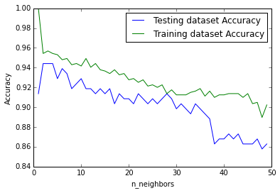
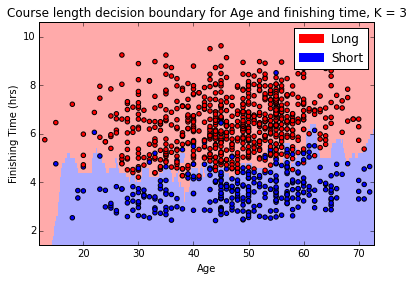

## Part 3 - Building a Simple Model

(Note: the accompanying code and data for this series can be found on my personal [Github page](https://github.com/fddata/MullCycle){:target="_blank"}.)

With our dataset now explored in [Part 1]() and cleaned in [Part 2]() it is finally time to do some data science!  Let's build a simple model on the male finishing times subset we looked at in Part 2.
One of the hardest parts of any data project is deciding what algorithm to use when modelling the data. 
To keep things simple I am going to use the K nearest neighbours (KNN) algorithm, which is a common clustering method that works will with low dimensionality datasets like ours.
In follow-up posts I will examine the same dataset using some other classification algorithms to show how their accuracy (and implementation) varies.

KNN is a popular classification algorithm becuase it is simple to implement and computationally relatively cheap for low values of K.
If used for classification, KNN works by determining the classes of the neighbouring datapoints closest to the point we are trying to classify.
For example, if we decide to look at the 5 nearest neighbours and 3 are category 'A' and 2 are category 'B', then our data point will be classified as belonging to 'A'.
We can control the exact number of neighbours that we investigate (the 'K' parameter) and the best value of K  [varies with each dataset](https://www.datacamp.com/community/tutorials/k-nearest-neighbor-classification-scikit-learn#how-do-you-decide-the-number-of-neighbors-in-knn-){:target="_blank"} - there are no hard and fast rules as to what value to use.
In this example I will show a simple method to determine what the K value should be.

We will be using the SciKit-Learn library to perform the classification, and displaying the results using matplotlib.
As with the other parts of the project, I will create a spearate script to run the KNN classification model.  We therefore need to begin by reading in the data and creating the datadframe that we will use for the modeling.
We will also split our data 80/20 into train and test sets.

```python
# read in csv and filter data on the subset we want
csv_loc = 'C:\\Users\\MyOutputLocation\\df_mf.csv'
df = pd.read_csv(csv_loc, index_col=0)
df = df[df.gender == 'M'] 
df = df[['age', 'time','course']].dropna(subset = ["age"])


# Split into training and test set and encode labels
train=df.sample(frac=0.8,random_state=999) 
test=df.drop(train.index)
  
labelEnc = preprocessing.LabelEncoder()

X_prime = np.array(map(list, zip(df.age, df.time)))
X_train =   np.array(map(list, zip(train.age, train.time)))
X_test =  np.array(map(list, zip(test.age, test.time)))

y_train = labelEnc.fit_transform(train['course'])
y_test = labelEnc.fit_transform(test['course'])
y_prime = labelEnc.fit_transform(df['course'])
```

Now how to determine what the value of K should be?
A common technique is known as the elbow method, where we see how the model accuracy increases with increasing values of K.
The value of K is chosen to be that where there is a kink or elbow in the curve:

```python
neighbors = np.arange(1, 50) 
train_accuracy = np.empty(len(neighbors)) 
test_accuracy = np.empty(len(neighbors)) 
  
# Loop over K values 
for i, k in enumerate(neighbors): 
    knn = KNeighborsClassifier(n_neighbors=k) 
    knn.fit(X_train, y_train) 
      
    # Compute traning and test data accuracy 
    train_accuracy[i] = knn.score(X_train, y_train) 
    test_accuracy[i] = knn.score(X_test, y_test) 
  
# Generate plot 
plt.plot(neighbors, test_accuracy, label = 'Testing dataset Accuracy') 
plt.plot(neighbors, train_accuracy, label = 'Training dataset Accuracy') 
  
plt.legend() 
plt.xlabel('n_neighbors') 
plt.ylabel('Accuracy') 
plt.show() 
```

Which gives the following:



From the above we can see that the highest testing accuracy occurs where K = 2 and 3.
It is convention to use an odd number when the number of classes is even, so we can use K = 3 in our example.
Now that we know what value we can use for K, we can attempt to visualise the decision boundary for our original question: given an age and finishing time, can we predict if the rider has completed the long or short course?

In order to plot the decision boundary we first have to create a mesh for each point on our plot.
Thankfully we can use [the documentation example](https://scikit-learn.org/stable/auto_examples/neighbors/plot_classification.html#sphx-glr-auto-examples-neighbors-plot-classification-py){:target="_blank"} as a guide:

```python
n_neighbors=3

clf = KNeighborsClassifier(n_neighbors)
clf.fit(X_train, y_train)

# declare axes and step size
X = X_prime
y = y_prime
h = 0.2

# Plot the decision boundary and assign a color to each point in the mesh.
x_min, x_max = X[:, 0].min() - 1, X[:, 0].max() + 1
y_min, y_max = X[:, 1].min() - 1, X[:, 1].max() + 1
xx, yy = np.meshgrid(np.arange(x_min, x_max, h),
                     np.arange(y_min, y_max, h))
Z = clf.predict(np.c_[xx.ravel(), yy.ravel()])

# Put the result into a color plot
cmap_light = ListedColormap(['#FFAAAA', '#AAAAFF'])
cmap_bold  = ListedColormap(['#FF0000', '#0000FF'])
Z = Z.reshape(xx.shape)
fig = plt.figure()
plt.pcolormesh(xx, yy, Z, cmap=cmap_light)

# Plot the training points
plt.scatter(X[:, 0], X[:, 1], c=y, cmap=cmap_bold, edgecolor='k', s=20)   
plt.xlim(xx.min(), xx.max())
plt.ylim(yy.min(), yy.max())

# build the legend and show the plot
long_course = mpatches.Patch(color='red', label='Long')
short_course = mpatches.Patch(color='blue', label='Short')
plt.legend(handles=[long_course, short_course])
plt.xlabel('Age') 
plt.ylabel('Finishing Time (hrs)') 
plt.title("Course length decision boundary for Age and finishing time, K = %i" % (n_neighbors))
plt.show()
```
Which gives the following:



We can see from the above diagram that the algorithm has done a decent job in calculating the boundary between the short course and the long course, although it is not perfect (we know it is about 95% accurate from the earlier test where the value of K was selected) it is certainly pretty close.
Finally, we can now plug in any values we want into our model and it will tell us what course we are likely to have run depending on our age and time:

```python
knn = KNeighborsClassifier(n_neighbors=3)    
knn.fit(X_prime, y_prime)

prediction1 = knn.predict([50,5]) # 50 y/o, 5 hours
prediction2 = knn.predict([50,4.5]) # 50 y/o, 4.5 hours

print(prediction1) 
# returns [0] (long course)
print(prediction2)
# returns [1] (short course)
```

From the above we can see that the course prediction for a 50 year old male changes from long course to short course as their finishing time changes from 5 hours to 4.5 hours.
This makes sense, and is borne out by investigation of the decision boundary we plotted earlier.  Neat, right?


## Conclusion

Hopefully this short series has helped illustrate some of the considerations that are required for a data science project, even one as simple as analysing a small dataset like that of the Mull sportive!
The KNN clustering algorithm provided as part of the Scikit-learn package is simple enough to implement that once we have our data in the format we require not a lot of code is required to start making predictions.
There are many more aspects to the data that we could model - we could look at predicting gender based on finishing times, or even try to guess the average finishing times for the next sportive based on the weather forecast - the possibilities are near limitless and are only bounded by the imagination of the investigator.

This was the first data science project of mine that I have written up, I'm not ashamed to admit that it took me longer than I'd like to admit to finish, but I learned a lot and hopefully inspired someone to try a project of their own.
