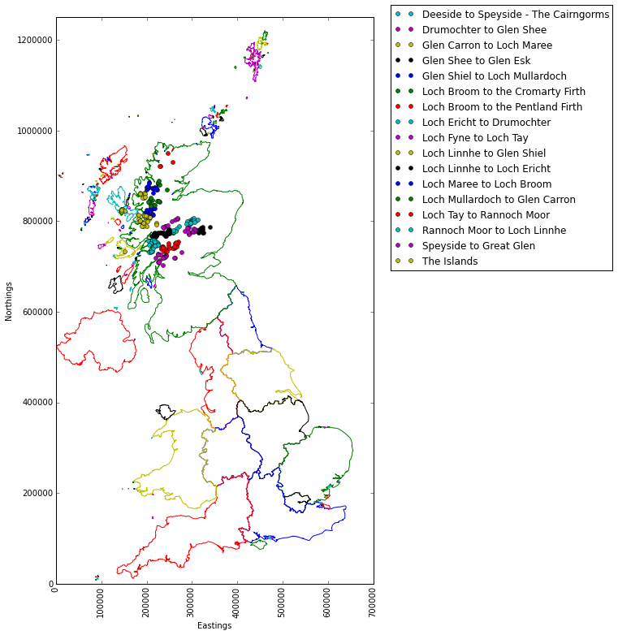
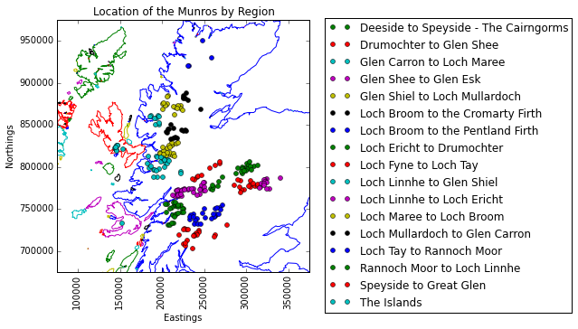

## Part 1 - Introduction / Getting the Data

(Note: the scripts relating to this post can be found on my personal [Github page](https://github.com/fddata/explore_munros){:target="_blank"}.)

For this post I wanted to try working with some Geographic data in Python, as well as look for an opportunity to expand on the [Machine Learning example](){:target="_blank"} I did in my last post. 

Spending the majority of spring and summer 2020 under a coronavirus-imposed lockdown gave me plenty of time to plan and scheme adventures for when restrictions were finally lifted, which lead to the inspiration for this series. Fortunately for me I have some great outdoor activities a few hours' drive from where I live, with one of my favourites being hillwalking. The Scottish hills are famous the world over for their splendid views, ruggedness and isolation.  Climbing them can be addictive, with all manner of skill (and fitness!) [levels catered for](https://en.wikipedia.org/wiki/Lists_of_mountains_and_hills_in_the_British_Isles#Scotland_only){:target="_blank"} - from the smallest Marilyns, to the proud Donalds, Grahams and craggiest of Corbetts. However, of all the hills you can climb in Scotland it is undoubtably the Munros which have the greatest allure.  These are the hills whose summit rests at least 3,000 ft over sea level and are spread across the land, either in isolation or in impressive ranges.

The official number of Munros has changed a little over the years, with summits being promoted or relegated by the SMC---usually due to their proximities to other summits marking them as 'tops' rather than munros in their own right (only those of ["sufficient separation"](https://www.smc.org.uk/hills/hill-lists){:target="_blank"} need apply). There are currently 282 Munros spread across Scotland, and some will dedicate a lifetime trying to ascend each one (usually on a fair weather weekend). There are others who would prefer to do it over a shorter period, the current human-powered record is only [39 days and nine hours!](https://www.fionaoutdoors.co.uk/2010/06/fell-runner-breaks-record-for-fastest-munro-round.html){:target="_blank"}

As the Munros are spread across the land, they can be grouped into distinct regions, each with their own characteristics: from the bleak and featureless [Cairngorm plateau](https://www.caingram.info/Scotland/Pic_htm/cairngorm.htm){:target="_blank"} to the craggy summits of [Wester Ross](https://www.visitwester-ross.com/land-of-wester-ross.asp){:target="_blank"}---distinctions that arise from the vagaries of ice age geological processes.

Nowadays the location of each of the summit is well documented, with many [online resources](https://www.walkhighlands.co.uk/){:target="_blank"} available to help you plan a route and record how many you still have left to climb.  There is also an excellent machine-readable resource (shoutout to [John Easton](https://twitter.com/johneas10){:target="_blank"} for the excellent [Munro API](https://munroapi.herokuapp.com/){:target="_blank"}) where we can access information for all the Munros in JSON format.  Spending quarantine poring over maps of the highlands made me want to have a go at plotting my own map data in Python, something I have often thought about doing but never had the time. Every silver cloud etc...   To handle the mapping of the country outlines I will be attempting to read the publicly available Eurostat boundaries available on the UK government's [Open Geography portal](https://geoportal.statistics.gov.uk/datasets/nuts-level-1-january-2018-full-clipped-boundaries-in-the-united-kingdom){:target="_blank"}.


For this post we will be plotting data from two sources on the same plot - the map outline data (from a shapefile, more on this below) and the Munro data (from the Munro API).  Let's look at each in turn before we bring them together.


### Getting the shapefile data

There are a number of different ways to visualise geospatial data in Python. For this series I decided to use the PyShp package to read in the files I obtained from the UK Government website, in part due to the [excellent documentation](https://pypi.org/project/pyshp/){:target="_blank"} which made it clear how to interrogate the shapefile. The shapefile data is provided in a zip file containing the .shp file itself and a few support files.
To read the file we pass its location to the PyShp package like so:

```python
import shapefile as shp

shp_loc = r'shapefile/NUTS_Level_1/NUTS_Level_1__January_2018__Boundaries'
sf = shp.Reader(shp_loc)
```

This will create a shapefile reader object ``sf`` in memory that we can interrogate. To determine the makeup of the shapefile we have to examine its records like so:

```python
len(sf.records())
#returns 12 - meaning there are 12 distinct records in the shapefile.  What does each one refer to?

sf.records()[0]
#returns
Record #0: 
[1, 
 u'UKC', 
 u'North East (England)', 
 417313, 
 600358, 
 -1.72889996, 
 55.297031399999995, 
 8609938892.516281, 
 657578.2253037834]
```

To work out what these 9 fields refer to we can interrogate the shapefile's ``fields`` parameter:
```python
sf.fields

#returns
[('DeletionFlag', 'C', 1, 0),
 [u'objectid', u'N', 2, 0],
 [u'nuts118cd', u'C', 3, 0],
 [u'nuts118nm', u'C', 24, 0],
 [u'bng_e', u'N', 6, 0],
 [u'bng_n', u'N', 6, 0],
 [u'long', u'N', 24, 15],
 [u'lat', u'N', 24, 15],
 [u'st_areasha', u'N', 24, 15],
 [u'st_lengths', u'N', 24, 15]]
```

Which makes sense, we know record ``[0]`` has 9 data categories which correlate to the above fields.  It seems the ``nuts118nm`` field contains the region name---so what are the regions we have in our shapefile?

```python
regions = [record.record['nuts118nm'] for record in sf.shapeRecords()]
print regions

#returns
[u'North East (England)', 
 u'North West (England)', 
 u'Yorkshire and The Humber', 
 u'East Midlands (England)', 
 u'West Midlands (England)', 
 u'East of England', 
 u'London', 
 u'South East (England)', 
 u'South West (England)', 
 u'Wales', 
 u'Scotland', 
 u'Northern Ireland']
```

Now we know what the 12 regions are we can have a look at attempting to visualise them. From the documentation we know that each  region has a 'shape' property in addition to the 'record' part that we have already examined. This 'shape' property itself contains the following parameters:
 - ``bbox`` -  coordinates for the bounding box
 - ``parts`` - a list of indexes for the different parts (the indexes refer to the list of ``points`` below)
 - ``points`` - a list of coordinates corresponding to each point of the specific shape.  In our case each point is a tuple of x,y coordinates
 - ``shapeType`` - an integer value referring to the format of the shape.  In our case this is ``5``, referring to a polygon.
 - ``shapeTypeName`` - string value referring to the format of the shape.  In our case this returns ``'POLYGON'``.

In order to plot the data we will need to loop through each of the 12 regions contained in the shapefile. For each region, we will then need to loop through each of its 'parts' (as given by the points indexes contained in the ``parts`` parameter). For each of these parts, we will take the relevant number of x,y coordinates from the ``points`` list and plot these together. In code, this looks like:

```python
for record in sf.shapeRecords():
    #uncomment the two lines below to add conditional region plotting
    #if record.record['nuts118nm'] != 'Scotland':   
    #    continue
    num_parts = len(record.shape.parts)
    for i in range(num_parts):
        i_start = record.shape.parts[i]
        if i == (num_parts - 1):
            i_end = len(record.shape.points)
        else:
            i_end = record.shape.parts[i + 1]
        x = [i[0]  for i in record.shape.points[i_start:i_end]] 
        y = [i[1]  for i in record.shape.points[i_start:i_end]]
        plt.plot(x,y)

#plot axis options etc
plt.xlim(0,700000)
plt.ylim(0, 1250000)
plt.rcParams["figure.figsize"] = (7/7, 12.5/7 )    # so each northing/easting has the same scale   
plt.xlabel('Eastings')
plt.xticks(rotation=90) 
plt.ylabel('Northings') 
plt.show()

``` 

which gives:


We can see each part of each region has been given a different colour by default, which I think looks pretty cool! It is worth noting that the shapefile did not provide lat/long coordinates, but rather eastings/northings as per the [Ordnance Survey (OS) grid system](https://en.wikipedia.org/wiki/Ordnance_Survey_National_Grid){:target="_blank"}. Hopefully this won't prove problematic when we are looking to overlay the Munro data. Lets find out...

### Getting the Munro data

Getting the Munro data should be straightforward.  We can use Pandas to build our dataframe directly from the API query:

```python
import pandas as pd    
url = 'https://munroapi.herokuapp.com/munros'
csv_loc = r'my_munro_data.csv'

df = pd.read_json(url)
df.to_csv(csv_loc, encoding='utf-8')  #store locally for safe keeping
print df.count()

#gridref_eastings     282
#gridref_letters      282
#gridref_northings    282
#height               282
#latlng_lat           282
#latlng_lng           282
#meaning              282
#metoffice_loc_id     282
#name                 282
#region               282
#smcid                282
```

We have a variety of data here, relating to latitude and longitude, as well as the British Ordnance Survey grid reference and letters, names, meanings and regions.  There are 282 values for each column, meaning we do not have to worry about null values.

What are the different regions?
```python
df.region.value_counts()

#returns
Loch Linnhe to Loch Ericht              34
Loch Tay to Rannoch Moor                26
Rannoch Moor to Loch Linnhe             26
Loch Linnhe to Glen Shiel               26
Glen Shiel to Loch Mullardoch           22
Loch Fyne to Loch Tay                   20
Deeside to Speyside - The Cairngorms    18
Loch Maree to Loch Broom                18
Drumochter to Glen Shee                 15
Loch Mullardoch to Glen Carron          14
Glen Shee to Glen Esk                   14
The Islands                             13
Speyside to Great Glen                   9
Glen Carron to Loch Maree                9
Loch Broom to the Cromarty Firth         7
Loch Ericht to Drumochter                7
Loch Broom to the Pentland Firth         4

len(df.region.value_counts())
#returns 17
```
This is great, we have 17 distinct regions with varied population sizes for each.  In order to plot these on our map we need to know their positions. As we saw previously, the UK map is provided in terms of eastings and northings.  In the UK, eastings and northings on OS maps are used to define positions within Great Britain. They take the format of two letters which describe a [500 by 500 km grid](https://en.wikipedia.org/wiki/File:British_National_Grid.svg){:target="_blank"}. Following the two letters are an even number of digits, the first half of which describe the Eastern position within the letter square, the second half of which describe the Northern position. The number of digits relates to the granularity of the position, with more digits equating to a smaller and smaller area.

The Munro API provides the letters, eastings and northings for each Munro:

```python
df.head(1)[['gridref_eastings', 'gridref_letters',  'gridref_northings']]

#returns
#   gridref_eastings gridref_letters  gridref_northings
#0             16675              NN              71283
```
 
So we can see the long form grid reference for the first Munro can be written as  NN 16675  71283 (coincidentally this is Ben Nevis, the highest point in the UK). However, this is no use for us as the shapefile map data does not contain any lettering. This means we will have to manually determine northings and eastings that our letters apply to.  What letters do we have?

```python
df.gridref_letters.unique()
#returns array([u'NN', u'NJ', u'NH', u'NO', u'NG', u'NM', u'NC'], dtype=object)
```

Thankfully there are only 7 unique values to deal with here. We can refer to the [OS Grid System map](https://en.wikipedia.org/wiki/File:British_National_Grid.svg){:target="_blank"} to work out what they need to be.  To update our dataframe I will write a couple of helper functions to generate the full eastings and northings coordinates to match the system used in our outline map:

```python
#store grid letters in a dictionary
grid_letters = {
'NN': (200000,700000), 
'NJ': (300000,800000), 
'NH': (200000,800000),
'NO': (300000,700000), 
'NG': (100000,800000), 
'NM': (100000,700000), 
'NC': (200000,900000)}

def get_eastings(x):
    return grid_letters[x][0]

def get_northings(x):
    return grid_letters[x][1]

df['mapref_eastings'] = df["gridref_letters"].map(lambda x: get_eastings(x)) + df["gridref_eastings"]
df['mapref_northings'] = df["gridref_letters"].map(lambda x: get_northings(x)) + df["gridref_northings"]
```


### Putting it all together

Now all that remains is for us to overlay these new ``['mapref_eastings']`` and ``['mapref_northings']`` dataframe columns on top of the UK outline map.  For clarity I've grouped the Munros by their regions (as provided by the Munro API):




Or I can restrict the plot only to the ``Scotland`` shapefile region, adjust the N/E limits and add a legend for clarity:



Which is just the plot I was looking for to end Part 1 of this series on.  For Part 2 I will be looking at how to build a model to help us predict which region a Munro belongs to, based on its eastings and northings values.  As we have a few closely-knit regions here it could be quite a challenge!

(Note: the scripts relating to this post can be found on my personal [Github page](https://github.com/fddata/explore_munros){:target="_blank"}.)
