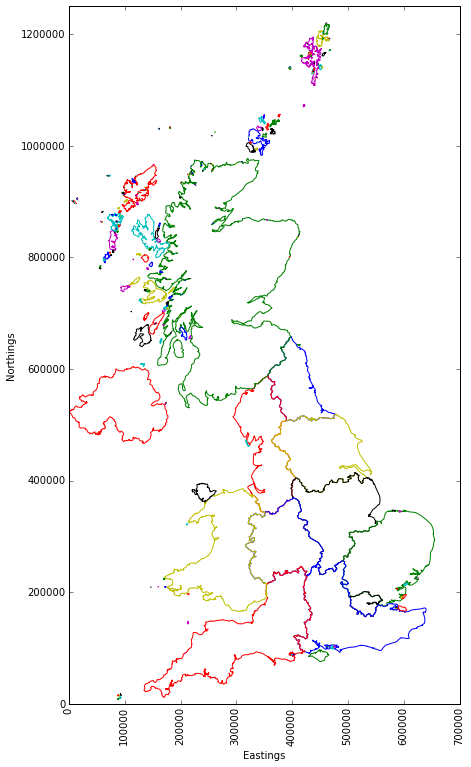

[Link Text](http://www.link.com){:target="_blank"}

## Introduction 

For this post I wanted to try working with some Geographic data in Python, as well as look for an opportunity to 

Spending the majority of spring and summer 2020 under a coronavirus-imposed lockdown gave me plenty of time to plan and scheme adventures for when restrictions were finally lifted.
Fortunately for me I have some great outdoor activities a few hours drive from where I live, with one of my favourites being hillwalking.
The Scottish hills are famous the world over for their splendid views, ruggedness and isolation.  Climbing them can be addictive.
Luckily there is something for everyone, easy ones, short ones, shallow ones, steep ones.  Some the size of your head.

Of all the hills you can climb in Scotland the Munros have the greatest allure.  These are the hills whose summit rests at least 3,000 ft over sea level.

The official number of Munros has changed a little over the years, with summits being promoted or relegated by the [???] - usually due to their proximities to other summits marking them as 'tops' rather than munros in their own right.
There are currently 282 ??? Munros spread across Scotland, and some will dedicate a lifetime trying to ascend each one (usually on a fair weather weekend!).
There are others who would prefer to do it over a shorter period, the current record is ???, and the human-powered record is only ???. !!!

As the Munros are spread across the land, they can be grouped into distinct regions, each with their own characteristics: from the bleak and featureless Cairngorm plateau to the craggy summits of Wester Ross ??? - distinctions that arise from the vagries of ice age geological processes.

Nowadays the locations of each of the summits are well known, with many online resources available to help you plan a route and record how many you still have left to climb.
problem.  There is also an excellent machine-readable resource (shoutout to [John Easton](https://twitter.com/johneas10){:target="_blank"} for the excellent [Munro API](https://munroapi.herokuapp.com/){:target="_blank"}) where we can access information for all the Munros in JSON format.
To handle the mapping I will be attempting to read the publicly available Eurostat boundaries availble on the UK government's [Open Geography portal](https://geoportal.statistics.gov.uk/datasets/nuts-level-1-january-2018-full-clipped-boundaries-in-the-united-kingdom){:target="_blank"}.


TODO: something about walk highlands


## Part 1 - Getting the Data

For this post we will be plotting data from two sources on the same plot - the map outline data (from a shapefile) and the Munro data (from the Munro API).  Let's look at each in turn before we bring them together.


### Getting the shapefile data

There are a number of different ways to visualise geospatial data in Python.
For this example I decided to use the PyShp package to read in the files I obtained from the UK Government website, in part due to the [excellent documentation](https://pypi.org/project/pyshp/){:target="_blank"}.
The shapefile data is provided in a zip file containing the .shp file itself and a few support files.
To read the file we pass its location to the PyShp package like so:

```python
import shapefile as shp

shp_loc = r'shapefile/NUTS_Level_1/NUTS_Level_1__January_2018__Boundaries'
sf = shp.Reader(shp_loc)
```

This will create a shapefile reader object in memory that we can interrogate. To determine the makeup of the shapefile we have to examine its records like so:

```python
len(sf.records())
#returns 12 - meaning there are 12 distinct regions in the shapefile.  What does each one contain?

sf.records()[0]
#returns
Record #0: 
[1, 
 u'UKC', 
 u'North East (England)', 
 417313, 
 600358, 
 -1.72889996, 
 55.297031399999995, 
 8609938892.516281, 
 657578.2253037834]
```

To work out what these 9 data points refer to we can interrogate the shapefile's ``fields`` paramater:
```python
sf.fields

#returns
[('DeletionFlag', 'C', 1, 0),
 [u'objectid', u'N', 2, 0],
 [u'nuts118cd', u'C', 3, 0],
 [u'nuts118nm', u'C', 24, 0],
 [u'bng_e', u'N', 6, 0],
 [u'bng_n', u'N', 6, 0],
 [u'long', u'N', 24, 15],
 [u'lat', u'N', 24, 15],
 [u'st_areasha', u'N', 24, 15],
 [u'st_lengths', u'N', 24, 15]]
```

Which makes sense, we know record ``[0]`` has 9 data points which correlate to these fields.  It seems the ``nuts118nm`` field contains the region name---so what are the regions we have in our shapefile?

```python
regions = [record.record['nuts118nm'] for record in sf.shapeRecords()]
print regions

#returns
[u'North East (England)', 
 u'North West (England)', 
 u'Yorkshire and The Humber', 
 u'East Midlands (England)', 
 u'West Midlands (England)', 
 u'East of England', 
 u'London', 
 u'South East (England)', 
 u'South West (England)', 
 u'Wales', 
 u'Scotland', 
 u'Northern Ireland']
```

Now we know what the 12 regions are we can have a look at attempting to visualise the different regions.
From the documentation we know that each  region has a 'shape' property in addition to the 'record' part that we have already examined.
This 'shape' property itself contains the following parameters
 - ``bbox`` -  coordinates for the bounding box
 - ``parts`` - a list of indexes for the different parts (the indexes refer to the list of ``points`` below)
 - ``points`` - a list of coordinates corresponding to each point of the specific shape.  In our case each point is a tuple of x,y coordinates
 - ``shapeType`` - an integer value referring to the format of the shape.  In our case this is ``5``, referring to a polygon.
 - ``shapeTypeName`` - string value referring to the format of the shape.  In our case this returns ``'POLYGON'``.

In order to plot the data we will need to loop through each of the 12 regions contained in the shapefile.
For each region, we will then need to loop through each of its 'parts' (as given by the points indexes contained in the ``parts`` parameter).
For each of these parts, we will take the relevant number of x,y coordinates from the ``points`` list and plot these together.
In code, this looks like:

```python
for record in sf.shapeRecords():
    #uncomment out the two below lines to add conditional region plotting
    #if record.record['nuts118nm'] != 'Scotland':   
    #    continue
    num_parts = len(record.shape.parts)
    for i in range(num_parts):
        i_start = record.shape.parts[i]
        if i == (num_parts - 1):
            i_end = len(record.shape.points)
        else:
            i_end = record.shape.parts[i + 1]
        x = [i[0]  for i in record.shape.points[i_start:i_end]] 
        y = [i[1]  for i in record.shape.points[i_start:i_end]]
        plt.plot(x,y)

#plot axis options etc
plt.xlim(0,700000)
plt.ylim(0, 1250000)
plt.rcParams["figure.figsize"] = (7/7, 12.5/7 )    # so each northing/easting has the same scale   
plt.xlabel('Eastings')
plt.xticks(rotation=90) 
plt.ylabel('Northings') 
plt.show()

``` 

which gives:



We can see each part of each region has been given a different colour by default, which I think looks pretty cool!
It is worth noting that the shapefile did not provide lat/long coordinates, but rather Eastings/Northings as per the Ordenance Survey grid system.
Hopefully this won't prove problematic when we are looking to overlay the munro data. Lets find out...

### Getting the Munro data

Getting the Munro data should be straightforward.  We can use Pandas to build our dataframe directly from the API query:

```python
import pandas as pd    
url = 'https://munroapi.herokuapp.com/munros'
csv_loc = r'my_munro_data.csv'

df = pd.read_json(url)
df.to_csv(csv_loc, encoding='utf-8')  #store locally for safe keeping
print df.count()

#gridref_eastings     282
#gridref_letters      282
#gridref_northings    282
#height               282
#latlng_lat           282
#latlng_lng           282
#meaning              282
#metoffice_loc_id     282
#name                 282
#region               282
#smcid                282
```

We have a variety of data here, relating to latitude and longitude, as well as the British Ordinance Survey grid reference and letters, names, meanings and regions.  There are 282 values for each column, meaning we do not have to worry about null values.

what are the different regions?
```python
df.region.value_counts()

#returns
Loch Linnhe to Loch Ericht              34
Loch Tay to Rannoch Moor                26
Rannoch Moor to Loch Linnhe             26
Loch Linnhe to Glen Shiel               26
Glen Shiel to Loch Mullardoch           22
Loch Fyne to Loch Tay                   20
Deeside to Speyside - The Cairngorms    18
Loch Maree to Loch Broom                18
Drumochter to Glen Shee                 15
Loch Mullardoch to Glen Carron          14
Glen Shee to Glen Esk                   14
The Islands                             13
Speyside to Great Glen                   9
Glen Carron to Loch Maree                9
Loch Broom to the Cromarty Firth         7
Loch Ericht to Drumochter                7
Loch Broom to the Pentland Firth         4

len(df.region.value_counts())
#returns 17
```
This is great, we have 17 distinct regions with varied population sizes for each.  In order to plot these on our map we need to know their positions.
As we saw previously the UK map is provided in terms of Eastings and Northings, which correspond to x,y points on an OS map.


### Putting it all together